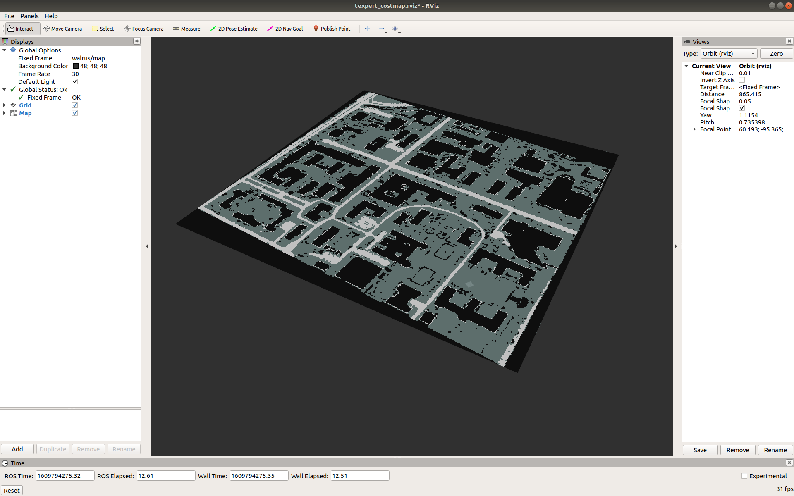

# texpert_costmap
Launches a TEXPERT-generated costmap of the UT campus. No need for Phoenix!


## Installation
Create the workspace, clone the repo, build and source.
```
cd ~
mkdir -p texpert_ws/src
cd texpert_ws/src/
git clone https://github.com/UTNuclearRobotics/texpert_costmap
cd ~/texpert_ws
catkin build
source devel/setup.bash
```

## Usage
Launch the static costmap broadcaster. At a console:
```
roslaunch texpert_costmap ut_campus.launch 
```
The map can now be visualized in RViz. At a console:
```
rviz -d ~/texpert_ws/src/texpert_costmap/rviz/texpert_costmap.rviz
```
